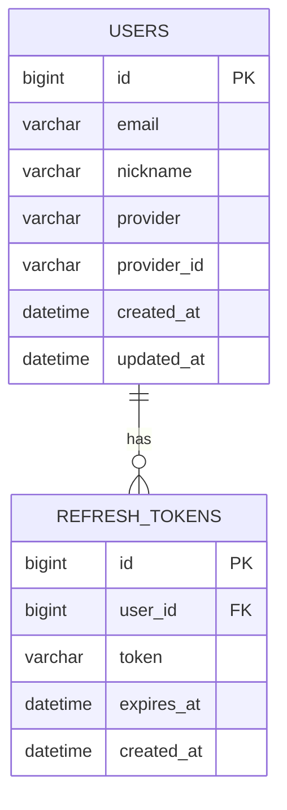

# EternyFrontend
<div align="center">
  
  <h1>Eterny</h1>
  <p>이터널리턴 전적 검색 플랫폼</p>
  
  **배포 링크**: [https://eterny.vercel.app/](https://eterny.vercel.app/)
</div>

---

## 📖 목차

1. [🔎 프로젝트 소개](#-프로젝트-소개)  
2. [🎯 프로젝트 기간](#-프로젝트-기간)
3. [🧑‍💻 팀원 소개 및 역할 분담](#-팀원-소개-및-역할-분담)
4. [⚙️ 기술 스택](#-기술-스택)  
5. [❓ 기술적 의사결정](#-기술적-의사결정)  
6. [🚀 주요 기능](#-주요-기능)  
7. [🖥 화면 설계](#-화면-설계)  
8. [🛠 ERD](#-erd)  
9. [📃 API 설계서](#-api-설계서)  
10. [🧩 문제 해결](#-문제-해결)  
11. [📈 성능 개선](#-성능-개선)  
12. [🚨 트러블 슈팅](#-트러블-슈팅)  
13. [📂 폴더 구조](#-폴더-구조)

---

## 🔎 프로젝트 소개
**Eterny**는 이터널리턴 게임의 전적 검색 및 통계 분석 플랫폼입니다. 

유저의 게임 전적, 랭킹, 매치 히스토리를 한눈에 확인할 수 있으며, 상세한 통계 분석을 통해 게임 실력 향상에 도움을 주는 서비스입니다.

- **🎮 게임**: 이터널리턴 (Eternal Return)
- **🔍 핵심 가치**: 직관적인 전적 검색, 상세한 통계 분석, 실시간 랭킹 시스템
- **📊 데이터 소스**: [이터널리턴 공식 API](https://open-api.bser.io/)

## 🎯 프로젝트 기간
**1차 MVP: 2024.12 ~ 2025.01** ✅ **완료 (95%)**
- 프로젝트 초기 설정 및 개발 환경 구축
- JWT + OAuth 인증 시스템 템플릿 개발
- 기본 프로젝트 아키텍처 완성
- 전적 검색 및 통계 시스템 구현

<details>
  <summary>🎇 프로젝트 실행 방법</summary>

### 1️⃣ Git Clone
```bash
git clone https://github.com/your-repo/eterny-frontend.git
```

### 2️⃣ 의존성 설치
```bash
cd eterny-frontend/frontend
npm install
```

### 3️⃣ 환경변수 설정
```bash
# .env.local 파일 생성
VITE_API_BASE_URL=your_backend_url
VITE_BSER_API_KEY=your_bser_api_key
```

### 4️⃣ 개발 서버 실행
```bash
npm run dev
```    
</details>

## 🧑‍💻 팀원 소개 및 역할 분담

|                      **김민주**                      |                     **조시훈**                     | 
|:-------------------------------------------------:|:-----------------------------------------------:|
|  <br/> **프론트엔드 리드**   |  <br/> **프론트엔드** | 
| • **핵심 시스템 개발**<br/>• 전적 검색 및 조회 시스템 구현<br/>• 성능 최적화 (가상화, 무한 스크롤)<br/>• 디자인 시스템 (TailwindCSS + shadcn/ui)<br/>• 상태관리 (Zustand) 및 라우팅 설계<br/>• API 통신 및 데이터 처리 로직<br/>• UI/UX 컴포넌트 개발 | • **프로젝트 기반 구축**<br/>• React + TypeScript 초기 설정<br/>• JWT + OAuth 인증 템플릿<br/>• 기본 컴포넌트 구조 설계 |

## ⚙️ 기술 스택

### **Language & Framework**
  

### **Design System & Style**
 

### **State Management & Data Fetching**
 

### **Performance & Virtualization**
 

### **Database**
 

### **Build Tools & Deployment**
 

### **Code Quality**
 

## ❓ 기술적 의사결정

### **📌 TypeScript**
**선택 이유**: 이터널리턴 API의 복잡한 게임 데이터 구조(캐릭터, 아이템, 매치 정보 등)를 안전하게 타입 정의하여 런타임 에러를 방지하고, 개발 단계에서 API 응답 데이터의 타입 안정성을 확보

### **📌 TanStack Query (React Query)**
**선택 이유**: 게임 전적 데이터의 실시간 조회 및 캐싱이 중요한 서비스 특성상, 서버 상태 관리에 최적화된 라이브러리가 필요. 자동 리페치, 백그라운드 업데이트, 스테일 타임 설정을 통해 최신 게임 데이터 제공

### **📌 Zustand**
**선택 이유**: 검색 필터, 유저 정보, UI 상태 등 클라이언트 전역 상태를 경량화하여 관리. Redux 대비 보일러플레이트가 적고 React Query와의 조합이 우수하며, 게임 데이터 검색 상태 관리에 최적화

### **📌 React Window + Infinite Loader**
**선택 이유**: 대량의 매치 히스토리 데이터(수천 개의 게임 기록)를 효율적으로 렌더링하기 위해 가상화 기술 도입. 메모리 사용량 최적화 및 스크롤 성능 향상으로 사용자 경험 개선

### **📌 TailwindCSS + shadcn/ui**
**선택 이유**: 게임 통계 대시보드, 차트, 테이블 등 복잡한 UI 컴포넌트를 빠르게 구현하고 일관된 디자인 시스템을 유지. 이터널리턴 게임의 UI/UX와 조화를 이루는 모던한 인터페이스 구현

## 🚀 주요 기능 (1차 MVP - 95% 완료)

### **🔧 개발 환경 세팅** ✅
- **프론트엔드 초기 설정**: React + TypeScript + Vite 환경 구축
- **백엔드 초기 설정**: Spring Boot + MySQL + Redis 환경 구축
- **개발 도구 구성**: ESLint, Prettier, 빌드 설정 완료
- **배포 환경**: Vercel (프론트엔드), AWS/Docker (백엔드) 설정

### **🔐 OAuth2.0 소셜 인증 시스템** ✅
- **OAuth2.0 소셜 로그인**: Google, Discord, Kakao 등 소셜 로그인 구현
- **OAuth2.0 소셜 회원가입**: 소셜 계정 기반 간편 회원가입
- **JWT 토큰 기반 인증**: 액세스/리프레시 토큰 구조 설계
- **보안 미들웨어**: JWT 검증 및 인가 로직 구현
- **인증 상태 관리**: Zustand 기반 전역 인증 상태 관리

### **🔍 플레이어 검색 및 전적 조회 시스템** ✅
- **✅ 플레이어 검색**: 닉네임 기반 유저 검색 및 자동완성 (디바운스 적용)
- **✅ 랭킹 정보 조회**: 티어별/모드별 랭킹 정보 및 통계 분석
- **✅ 매치 히스토리 (가상화)**: React Window 기반 무한 스크롤 최적화
- **✅ 전적 통계**: 승률, KDA, 캐릭터 사용률 등 종합 분석
- **✅ 실시간 데이터**: 이터널리턴 API 연동을 통한 최신 정보 제공
- **✅ 외부 API 연동 상태 표시**: 데이터 소스 신뢰도 및 업데이트 시간 표시

### **📊 고급 분석 및 예측 기능** ✅
- **✅ MMR 예측 시스템**: 목표 승수 기반 MMR 상승 예측 계산기
- **✅ 인터랙티브 랭킹 차트**: 사용자 정의 목표 설정 및 시각화
- **✅ 성과 예측**: 필요한 게임 수, 예상 랭크 상승 정보 제공
- **✅ 신뢰도 표시**: 예측 정확도 퍼센트 표시

### **⚡ 성능 최적화** ✅
- **✅ 가상화 구현**: 대용량 매치 리스트 가상화 렌더링
- **✅ 무한 스크롤**: InfiniteLoader를 통한 점진적 데이터 로딩
- **✅ 캐싱 전략**: TanStack Query 기반 지능형 데이터 캐싱
- **✅ 로딩 최적화**: 스켈레톤 UI 및 로딩 상태 관리

### **📡 API 연동 및 데이터 관리** ✅
- **이터널리턴 API 완전 연동**: 실시간 게임 데이터 조회
- **HTTP 클라이언트**: Axios 기반 최적화된 API 통신
- **에러 핸들링**: 포괄적 API 에러 처리 및 사용자 피드백
- **폴백 시스템**: 외부 API 실패 시 내부 DB 데이터 자동 전환

## 🖥 화면 설계 (1차 MVP 완료)

### **OAuth 인증 화면** ✅
- **소셜 로그인 페이지**: Google, Discord, Kakao OAuth 버튼 배치
- **회원가입 페이지**: 소셜 계정 기반 회원가입 프로세스
- **로그인 콜백 처리**: OAuth 인증 후 리다이렉트 처리 화면
- **인증 로딩 화면**: 토큰 처리 중 로딩 인터페이스

### **전적 검색 시스템** ✅
- **✅ 메인 검색 페이지**: 플레이어 닉네임 검색 인터페이스 (디바운스 적용)
- **✅ 검색 결과 화면**: 유저 기본 정보 및 랭킹 표시
- **✅ 전적 상세 페이지**: 종합 통계, 승률, KDA 분석 + 외부 API 상태 표시
- **✅ 매치 히스토리**: 가상화된 게임별 상세 기록 및 성과 표시 (무한 스크롤)

### **고급 분석 화면** ✅
- **✅ MMR 예측 대시보드**: 인터랙티브 목표 설정 및 예측 결과 시각화
- **✅ 랭킹 시뮬레이터**: 사용자 정의 승수 조정 및 실시간 예측 업데이트
- **✅ 신뢰도 인디케이터**: 예측 정확도 및 데이터 품질 표시

### **기본 레이아웃 구조** ✅
- **헤더 네비게이션**: 로그인/로그아웃 상태 표시 및 기본 메뉴
- **메인 랜딩 페이지**: 서비스 소개 및 검색 기능 중심
- **라우팅 설정**: React Router 기반 페이지 구조
- **반응형 레이아웃**: 모바일/데스크톱 대응 완전한 반응형 UI

## 🛠 ERD (1차 MVP)



**📝 1차 MVP 테이블 설명**
- **USERS**: 기본 유저 정보 및 OAuth 소셜 로그인 정보
- **REFRESH_TOKENS**: JWT 리프레시 토큰 관리

## 📃 API 설계서 (1차 MVP)

### **OAuth2.0 소셜 인증 API**
- `GET /api/auth/oauth/{provider}` - OAuth 로그인 리다이렉트 (Google, Discord, Kakao)
- `GET /api/auth/oauth/{provider}/callback` - OAuth 콜백 처리
- `POST /api/auth/oauth/register` - 소셜 계정 기반 회원가입
- `POST /api/auth/oauth/login` - 소셜 로그인 처리

### **JWT 토큰 관리 API**
- `POST /api/auth/refresh` - JWT 액세스 토큰 갱신
- `POST /api/auth/logout` - 로그아웃 및 토큰 무효화
- `GET /api/auth/verify` - 토큰 유효성 검증

### **✅ 전적 검색 및 조회 API**
- `GET /api/players/search?nickname={nickname}` - 플레이어 검색
- `GET /api/players/{userNum}/stats` - 플레이어 종합 통계
- `GET /api/players/{userNum}/matches` - 매치 히스토리 조회 (페이지네이션 지원)
- `GET /api/players/{userNum}/ranking` - 플레이어 랭킹 정보
- `GET /api/matches/{gameId}` - 매치 상세 정보
- `GET /api/players/{userNum}/mmr-prediction` - MMR 예측 정보 조회

### **기본 사용자 API**
- `GET /api/users/me` - 현재 로그인한 사용자 정보 조회
- `PUT /api/users/me` - 사용자 기본 정보 수정

### **시스템 상태 API**
- `GET /api/health` - 서버 상태 확인
- `GET /api/version` - API 버전 정보
- `GET /api/external-api/status` - 외부 API 연동 상태 확인

## 📈 성능 개선 (1차 MVP)

### **1. 프론트엔드 성능 최적화** ✅
- **가상화 구현**: React Window를 통한 대용량 리스트 렌더링 최적화
  - 매치 히스토리: 수천 개의 게임 기록을 메모리 효율적으로 표시
  - 가상 스크롤: 화면에 보이는 요소만 렌더링하여 성능 향상
- **무한 스크롤**: react-window-infinite-loader로 점진적 데이터 로딩
- **디바운스 검색**: 500ms 디바운스로 API 호출 최적화
- **스켈레톤 UI**: 로딩 중 사용자 경험 향상

### **2. 데이터 캐싱 및 상태 관리** ✅
- **TanStack Query 캐싱**: 게임 데이터 지능형 캐싱 전략
  - staleTime: 5분 (게임 데이터 특성 고려)
  - cacheTime: 30분 (메모리 효율성)
  - 자동 백그라운드 리페치
- **상태 최적화**: Zustand를 통한 효율적인 전역 상태 관리

### **3. 빌드 및 번들 최적화** ✅
- **Vite 설정**: 빠른 개발 서버 및 HMR 구성
- **TypeScript 컴파일**: 타입 체크 최적화 설정
- **번들 사이즈 분석**: 불필요한 의존성 제거
- **Code Splitting**: 라우트 기반 코드 분할

### **4. 코드 품질 관리** ✅
- **ESLint + Prettier**: 일관된 코드 스타일 적용
- **Husky + lint-staged**: 커밋 전 코드 검증 자동화
- **TypeScript strict 모드**: 타입 안정성 강화

## 🚨 트러블 슈팅 (1차 MVP)

### **1. React Window Infinite Loader 타입 에러 해결** ✅

**문제 상황**
- `react-window-infinite-loader` 타입 정의 누락으로 TypeScript 에러 발생
- `InfiniteLoader`와 `FixedSizeList` 간 ref 타입 호환성 문제

**해결 과정**
1. **타입 정의**: `src/types/react-window-infinite-loader.d.ts` 수동 생성
2. **ref 처리**: `useRef<FixedSizeList>(null)` 명시적 타입 지정
3. **props 매핑**: `hasNextPage`, `isNextPageLoading` 등 필수 props 정확한 매핑

**결과**
- 안정적인 가상화 무한 스크롤 구현
- TypeScript 완전 호환성 확보

### **2. 매치 데이터 타입 불일치 해결** ✅

**문제 상황**
- `PlayerMatches` 타입과 `Match[]` 배열 타입 간 불일치
- 컴포넌트 간 props 전달 시 타입 에러 발생

**해결 과정**
1. **타입 통합**: `Match` 인터페이스를 기본으로 타입 정의 통일
2. **데이터 변환**: API 응답을 컴포넌트에서 사용하는 타입으로 변환하는 유틸 함수 작성
3. **인터페이스 정리**: 불필요한 중복 타입 제거 및 단일 타입 체계 구축

**결과**
- 일관된 타입 시스템 구축
- 컴포넌트 간 안전한 데이터 전달

### **3. 외부 API 연동 상태 관리** ✅

**문제 상황**
- 이터널리턴 외부 API와 내부 DB 데이터 구분 필요
- 사용자에게 데이터 신뢰도 및 실시간성 정보 제공 필요

**해결 과정**
1. **API 응답 확장**: `isFromExternalApi`, `lastUpdated` 필드 추가
2. **상태 인디케이터**: 데이터 소스별 시각적 구분 및 안내
3. **수동 새로고침**: 사용자가 최신 데이터를 요청할 수 있는 버튼 제공

**결과**
- 투명한 데이터 소스 정보 제공
- 향상된 사용자 신뢰도 및 경험

### **4. OAuth 인증 플로우 구현** ✅

**문제 상황**
- Google OAuth 리다이렉트 처리 시 토큰 파싱 이슈
- 소셜 로그인 후 JWT 토큰 발급 플로우 복잡성

**해결 과정**
1. **OAuth 콜백 처리**: URL 파라미터에서 인증 코드 추출 로직 구현
2. **토큰 교환**: 백엔드에서 소셜 토큰을 JWT로 변환하는 API 개발
3. **상태 관리**: Zustand를 활용한 인증 상태 통합 관리

**결과**
- 안정적인 소셜 로그인 플로우 구축
- JWT 기반 인증 시스템 완성

## 📂 폴더 구조 (1차 MVP 현재 상태)
```bash
frontend/
├── src/
│   ├── components/
│   │   ├── ui/                    # shadcn/ui 기본 컴포넌트
│   │   ├── common/               # 공통 컴포넌트
│   │   │   ├── ErrorBoundary.tsx
│   │   │   ├── LoadingSpinner.tsx
│   │   │   └── TierBadge.tsx
│   │   ├── layout/               # 레이아웃 컴포넌트
│   │   │   └── LoadingStates.tsx
│   │   ├── player/               # ✅ 플레이어 관련 컴포넌트
│   │   │   ├── MatchCard.tsx     # 매치 카드 컴포넌트
│   │   │   ├── MatchFilters.tsx  # 매치 필터
│   │   │   ├── MatchHistory.tsx  # ✅ 가상화 무한 스크롤 매치 히스토리
│   │   │   ├── PlayerProfile.tsx
│   │   │   ├── PlayerRankInfo.tsx
│   │   │   └── PlayerStats.tsx
│   │   ├── rank/                 # ✅ 랭킹 관련 컴포넌트
│   │   │   └── RankChart.tsx     # ✅ MMR 예측 인터랙티브 차트
│   │   ├── match/                # 매치 관련 컴포넌트
│   │   │   └── MatchHistoryList.tsx
│   │   ├── optimized/            # 성능 최적화 컴포넌트
│   │   │   └── LazyImage.tsx
│   │   ├── CharacterStats.tsx
│   │   ├── EnhancedPlayerProfile.tsx
│   │   └── EnhancedSearchBar.tsx # ✅ 디바운스 검색바
│   ├── hooks/                    # 커스텀 훅
│   │   ├── useAsync.ts
│   │   ├── useDebounce.ts        # ✅ 검색 디바운스
│   │   ├── useErrorHandler.ts
│   │   ├── useLocalStorage.ts
│   │   ├── usePlayerData.ts
│   │   └── useVirtualization.ts  # ✅ 가상화 관련 훅
│   ├── pages/                    # 페이지 컴포넌트
│   │   ├── HomePage.tsx          # 메인 검색 페이지
│   │   ├── NotFoundPage.tsx
│   │   ├── PlayerDetailPage.tsx  # ✅ 외부 API 상태 표시 페이지
│   │   └── SearchPage.tsx
│   ├── services/                 # API 서비스
│   │   ├── api.ts               # 기본 API 클라이언트
│   │   ├── cacheService.ts      # 캐싱 서비스
│   │   ├── enhancedPlayerService.ts
│   │   ├── playerService.ts     # ✅ 플레이어 데이터 서비스
│   │   ├── rankService.ts       # ✅ MMR 예측 서비스
│   │   └── searchService.ts
│   ├── store/                   # Zustand 상태 관리
│   │   └── playerStore.ts       # 플레이어 전역 상태
│   ├── types/                   # TypeScript 타입
│   │   ├── api.ts              # API 응답 타입
│   │   ├── game.ts             # 게임 데이터 타입
│   │   ├── match.ts            # ✅ 매치 데이터 타입
│   │   ├── player.ts           # ✅ 플레이어 타입
│   │   ├── react-window-infinite-loader.d.ts # ✅ 가상화 타입
│   │   └── ui.ts
│   ├── utils/                  # 유틸리티 함수
│   │   ├── characterMapping.ts # 캐릭터 매핑
│   │   ├── constants.ts        # 상수 정의
│   │   ├── errorHandler.ts     # 에러 처리
│   │   ├── formatters.ts       # ✅ 데이터 포맷팅
│   │   ├── index.ts
│   │   ├── itemMapping.ts      # 아이템 매핑
│   │   └── validation.ts       # 유효성 검사
│   ├── styles/                 # 스타일 파일
│   │   └── design-tokens.css   # 디자인 토큰
│   ├── App.tsx                 # 메인 앱 컴포넌트
│   ├── main.tsx               # 앱 진입점
│   └── index.css              # 전역 스타일
├── public/                    # 정적 파일
├── image/                     # 이미지 리소스
│   ├── characters/           # 캐릭터 이미지
│   ├── items/               # 아이템 이미지
│   ├── tiers/               # 티어 이미지
│   └── traits/              # 특성 이미지
├── package.json
├── vite.config.ts
├── tailwind.config.js
└── tsconfig.json
```

## Dependencies (1차 MVP 현재 상태)
```json
{
  "dependencies": {
    "react": "^18.2.0",
    "react-dom": "^18.2.0",
    "react-router-dom": "^6.20.0",
    "typescript": "^5.0.0",
    "vite": "^5.0.0",
    "zustand": "^4.4.0",
    "axios": "^1.6.0",
    "@tanstack/react-query": "^5.0.0",
    "react-window": "^1.8.8",
    "react-window-infinite-loader": "^1.0.9",
    "@types/react-window": "^1.8.8",
    "tailwindcss": "^3.3.0",
    "@radix-ui/react-slot": "^1.0.0",
    "@radix-ui/react-dialog": "^1.0.0",
    "@radix-ui/react-select": "^1.0.0",
    "@radix-ui/react-toast": "^1.0.0",
    "@radix-ui/react-slider": "^1.0.0",
    "lucide-react": "^0.300.0",
    "class-variance-authority": "^0.7.0",
    "clsx": "^2.0.0",
    "tailwind-merge": "^2.0.0",
    "react-hook-form": "^7.45.0",
    "@hookform/resolvers": "^3.3.0",
    "zod": "^3.22.0"
  },
  "devDependencies": {
    "@types/react": "^18.2.0",
    "@types/react-dom": "^18.2.0",
    "@typescript-eslint/eslint-plugin": "^6.0.0",
    "@typescript-eslint/parser": "^6.0.0",
    "eslint": "^8.45.0",
    "eslint-plugin-react-hooks": "^4.6.0",
    "eslint-plugin-react-refresh": "^0.4.0",
    "prettier": "^3.0.0",
    "autoprefixer": "^10.4.0",
    "postcss": "^8.4.0"
  }
}
```

### **주요 의존성 설명**
- **React 18**: 프론트엔드 프레임워크 + Concurrent Features
- **TypeScript**: 타입 안전성 확보
- **Vite**: 빠른 개발 서버 및 빌드 도구
- **Zustand**: 경량 상태 관리
- **TanStack Query**: 서버 상태 관리 및 캐싱
- **React Window**: 가상화 기반 성능 최적화 ✅
- **React Window Infinite Loader**: 무한 스크롤 가상화 ✅
- **Axios**: HTTP 클라이언트
- **TailwindCSS**: 유틸리티 CSS 프레임워크
- **Radix UI**: 접근성 좋은 기본 컴포넌트
- **React Hook Form + Zod**: 폼 관리 및 유효성 검사

## 🔮 향후 개발 계획

### **1.5차 개발 - MVP 완성도 향상 (현재 95% → 100%)**
#### **담당: 김민주 (프론트엔드 리드)**
- **📊 외부 API 연동 완성**: 실시간 데이터 동기화 및 폴백 시스템 안정화
- **⚡ 성능 최적화 완성**: 가상화 시스템 고도화 및 메모리 최적화
- **🔍 고급 분석 완성**: MMR 예측 정확도 향상 및 추가 통계 지표
- **🎨 사용자 경험 개선**: 애니메이션, 인터랙션 고도화

### **2차 개발 (2025.02 ~ 2025.03) - 고급 분석 및 시각화**
#### **담당: 김민주 (프론트엔드) + 백엔드 지원**
- **고급 통계 시각화**: Chart.js/Recharts 기반 상세 통계 차트
- **매치 상세 분석**: 게임 타임라인, 아이템 빌드 분석
- **플레이어 비교 기능**: 다중 플레이어 전적 비교 시스템
- **더 많은 성능 최적화**: 추가 가상화 적용 영역 확장
- **UI/UX 개선**: 사용자 경험 최적화 및 인터랙션 강화

### **3차 개발 (2025.04 ~ 2025.05) - 실시간 채팅 시스템**
#### **담당: 김민주 + 조시훈 (풀스택 협업)**
- **접속 중인 전체 유저 채팅 기능** (김민주): WebSocket 기반 실시간 전체 채팅
- **채팅방 별 참여 유저 채팅 기능** (김민주): 방 단위 그룹 채팅 시스템
- **채팅 1건당 1Point 리워드 제공** (조시훈): 포인트 적립 시스템
- **유저 채팅 형광펜 효과 기능** (조시훈): 채팅 강조 및 스타일링
- **유저 닉네임 형광펜 효과 기능** (조시훈): 사용자 구분 UI

### **4차 개발 (2025.06 ~ 2025.07) - 관리자 및 통계 시스템**
#### **담당: 조시훈 + 신규 백엔드 개발자**
- **회원 관리 기능** (시훈): 관리자 회원 관리 대시보드
- **전체 공지사항 기능** (시훈): 시스템 공지 및 알림 기능
- **가입자 집계/통계 기능** (시훈): 회원 가입 현황 통계
- **접속자 집계/통계 기능** (시훈): 실시간 접속자 모니터링
- **채팅 특정 키워드 집계 및 통계 기능** (민주 + 시훈): 채팅 데이터 분석

### **5차 개발 (2025.08 ~ 2025.09) - 고급 분석 기능**
#### **담당: 김민주 + 데이터 분석가**
- **티어별 Top10 랭킹 표시** (민주): 실시간 랭킹 시스템
- **이미지 텍스트 인식** (민주): OCR 기반 게임 스크린샷 분석
- **전적 분석 및 결과 출력 기능** (민주): 상세 게임 통계 및 분석 리포트

### **6차 개발 (2025.10 ~ 2025.12) - AI/MCP 기반 지능형 서비스**
#### **담당: 풀스택 팀 + AI 엔지니어**
- **MCP 기반 시즌 요약 자동화 기능** (민주 + 시훈): 시즌별 성과 요약 AI
- **MCP 기반 유사 유저 클러스터링** (민주 + 시훈): 플레이 스타일 기반 유저 그룹화
- **MCP 기반 유저 맞춤 챔프/전략 추천 기능** (민주): AI 기반 캐릭터 추천
- **MCP 기반 플레이 리포트 자동 생성** (민주): 개인별 플레이 분석 리포트
- **MCP 기반 개인화 리포트 기능** (민주): 사용자 맞춤형 성장 가이드

### **개발 인력 계획**
- **1차 (완료)**: 김민주(프론트엔드 리드 + 백엔드), 조시훈(프론트엔드 기반 구축)
- **1.5차 (현재)**: 김민주 주도 (MVP 완성도 향상 95% → 100%)
- **2차**: 김민주 주도 (고급 분석 및 시각화)
- **3차**: 김민주 + 조시훈 풀스택 협업 (실시간 채팅 시스템)
- **4차**: 조시훈 주도 + 신규 백엔드 개발자 1명 (관리 시스템)
- **5차**: 김민주 주도 + 데이터 분석가 1명 (고급 분석)
- **6차**: 풀스택 팀 (4명) + AI 엔지니어 2명 + 데이터 사이언티스트 1명

---

**Eterny**와 함께 이터널리턴에서의 실력 향상을 경험해보세요! 🚀
